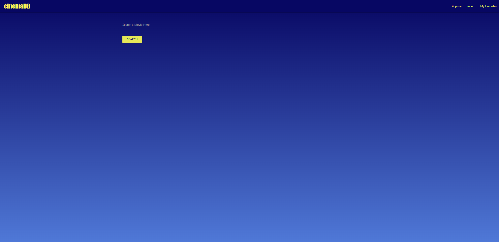

# CinemaDB with Materialize CSS

## Introduction

CinemaDB with Materialize CSS is a responsive web application that allows users to browse, search, and explore information about movies. It's built using the Materialize CSS framework, which provides a clean and modern user interface. Whether you're a movie enthusiast or just looking for something to watch, this website has you covered.

## Table of Contents
- [Features](#features)
- [Demo](#demo)
- [Installation](#installation)
- [Usage](#usage)
- [Credits](#credits)

##  Features

- Search for movies by title, genre or release year.
- View movie posters and trailers.
- Mark and save your favorite movies.
- Responsive design for an optimal viewing experience on both desktop and mobile devices.

## Demo

-   See the live demo of CinemaDB with Materialize CSS: [insert link]

## Installation

- To run this project locally, follow these steps:

1. Clone the repository: 

"$ git clone https://github.com/chadedwardsofficial/group-project1.git"

## Usage

-   Upon loading the website, you can start searching for movies using the search bar.
-   View details on movies upon search including the title and release date.
-   Watch the movie's trailer by clicking the "Youtube" icon.
-   Save your favorite movies by clicking on the "Heart" icon.
-   Unsave favorite movies by clicking the "Broken-Heart" icon.
-   Access your favorite movies by clicking on favorites in the navigation menu.
-   Enjoy exploring and discovering great movies!

## Credits

- Chad Edwards https://github.com/chadedwardsofficial
- Lauren Morrison https://github.com/Laulecmor
- Keung Inthachak https://github.com/kyungda
- Materialize CSS https://materializecss.com/
- TheMovieDB API https://api.themoviedb.org/3/search/movie
- Youtube API https://www.googleapis.com/youtube/v3/search